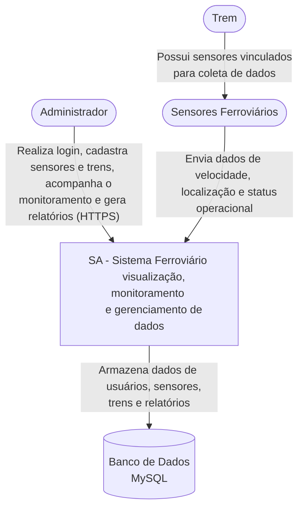

# SA-FERRORAMA

## Resumo

*O SA-FERRORAMA é um sistema desenvolvido para a visualização, monitoramento e gerenciamento de dados provenientes de sensores instalados em um ferrorama. Esses sensores são responsáveis por coletar informações relacionadas aos trens que circulam no ferrorama. Os dados coletados são posteriormente enviados ao sistema, onde são processados, organizados e apresentados ao usuário de forma clara e intuitiva.*

---


## Proposta

A principal proposta do projeto é centralizar as informações coletadas pelos sensores em uma única plataforma, facilitando o acompanhamento dos dados e permitindo uma melhor administração dos dispositivos ferroviários. Através da interface do sistema, o usuário poderá visualizar as informações coletadas, acompanhar o comportamento dos sensores e utilizar gráficos e indicadores para interpretar os dados de maneira mais rápida e eficiente.

Para o desenvolvimento da aplicação serão utilizadas tecnologias como XAMPP, PHP, HTML, CSS e JavaScript, responsáveis pela estrutura, funcionamento e interação do sistema. O Bootstrap será utilizado para auxiliar na construção de uma interface moderna, organizada e responsiva, proporcionando uma melhor experiência de uso em diferentes tamanhos de tela. Além disso, serão utilizados gráficos (Chart.js) para representar visualmente os dados dos sensores, facilitando a análise e a identificação de possíveis alterações ou comportamentos nos dispositivos monitorados.

O projeto também busca seguir boas práticas de desenvolvimento de software, mantendo o código organizado, estruturado e de fácil manutenção. Serão considerados princípios de organização de arquivos, separação de responsabilidades, validação de dados, segurança nas operações com o banco de dados e desenvolvimento de uma interface consistente e intuitiva. Além disso, o desenvolvimento do SA-FERRORAMA utiliza metodologias ágeis, com a aplicação regular de Scrum e Kanban para organizar as atividades, acompanhar o andamento do projeto, definir prioridades e facilitar a divisão das tarefas entre os integrantes da equipe.

---

## O Sistema conterá:
* Login de usuários
* Cadastro de usuários
* Visualização dos Dados dos Sensores em tempo real
* Edição de informações dos sensores
* Gerenciamento dos dados recebidos
* Edição de Sensores
* Edição de Trens
* Associação entre trens e sensores
* Autenticação

---

## Estrutura do Projeto

```text
├── assets/
│   ├── fonts/
│   └── images/
│
├── docs/
│   ├── pesquisa Sobre Xampp.md
│   ├── pesquisa_sobre_php_e_crud.md
│   ├── pesquisa_sobre_scrum.md
│   └── requisitos_de_sistema_da_sa.md
│
├── public/
│   ├── home.html
│   ├── monitoramento.html
│   ├── sensores.html
│   └── usuarios.html
│
├── scripts/
│   └── script.js
│
├── styles/
│   └── style.css
│
├── index.html
├── LICENSE
└── README.md
```

## Tecnologias Utilizadas:

<p align="center">
  
  
  
  
  
  
  
  
  
</p>


### Diagrama de Contexto


## Conclusão

O SA-FERRORAMA tem como objetivo unir a coleta de dados dos sensores ferroviários a uma plataforma de monitoramento acessível e visualmente organizada, permitindo que as informações captadas pelo Ferrorama sejam transformadas em dados úteis para o acompanhamento, análise e gerenciamento dos equipamentos.

## Licença
Este projeto está sob a licença MIT.  
Consulte o arquivo `LICENSE` para mais informações.
