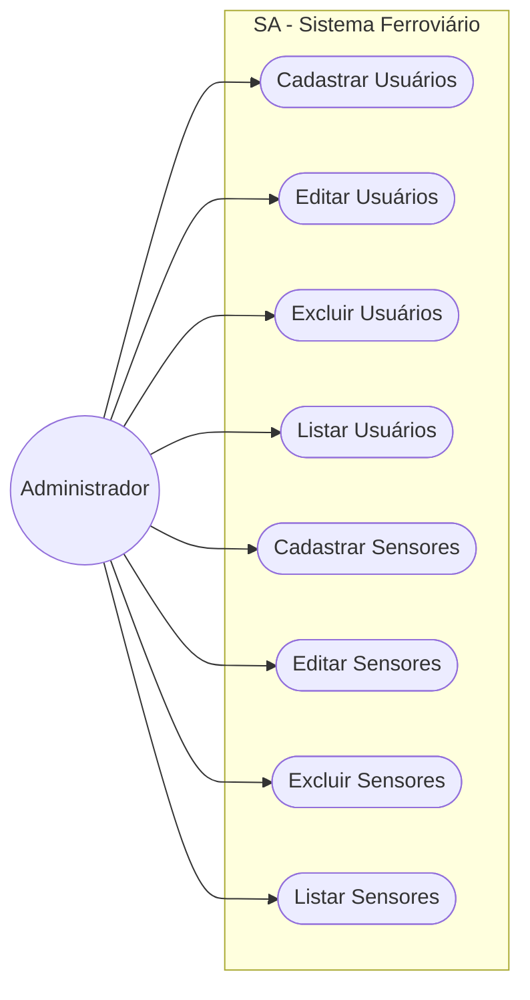

# SA-FERRORAMA
**Desenvolvimento de um software para visualização, monitoramento e gerenciamento de dados gerados por sensores ferroviários em tempo real.**

---


## Proposta
O SA-FERRORAMA é um sistema voltado para a visualização, monitoramento e gerenciamento de dados de sensores aplicados em trens.

A proposta do projeto é centralizar as informações captadas pelos sensores em uma interface moderna e intuitiva, permitindo melhor acompanhamento dos dados e facilitando a administração dos dispositivos ferroviários.

---

## O Sistema conterá:
* Login de usuários
* Cadastro de usuários
* Visualização dos Dados dos Sensores em tempo real
* Edição de informações dos sensores
* Gerenciamento dos dados recebidos
* Edição de Sensores
* Edição de Trens
* Associação entre trens e sensores
* Autenticação

---

## Estrutura do Projeto

```text
├── assets/
│   ├── fonts/
│   └── images/
│
├── docs/
│   ├── pesquisa Sobre Xampp.md
│   ├── pesquisa_sobre_php_e_crud.md
│   ├── pesquisa_sobre_scrum.md
│   └── requisitos_de_sistema_da_sa.md
│
├── public/
│   ├── home.html
│   ├── monitoramento.html
│   ├── sensores.html
│   └── usuarios.html
│
├── scripts/
│   └── script.js
│
├── styles/
│   └── style.css
│
├── index.html
├── LICENSE
└── README.md
```

## Tecnologias Utilizadas:

<p align="center">
  
  
  
  
  
  
</p>

## Caso de Uso:

## Licença
Este projeto está sob a licença MIT.  
Consulte o arquivo `LICENSE` para mais informações.
